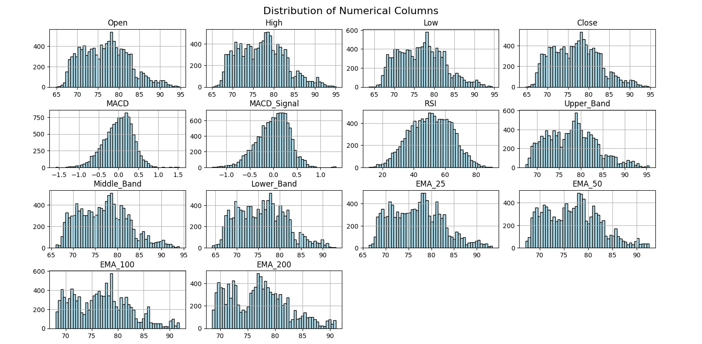
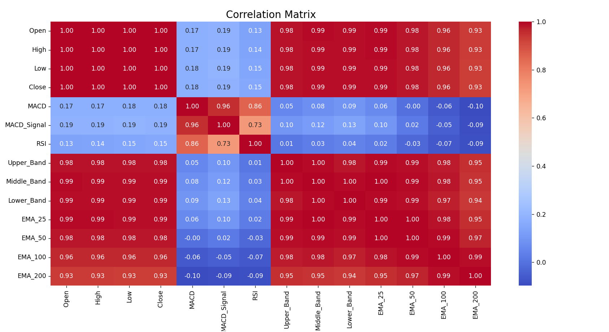
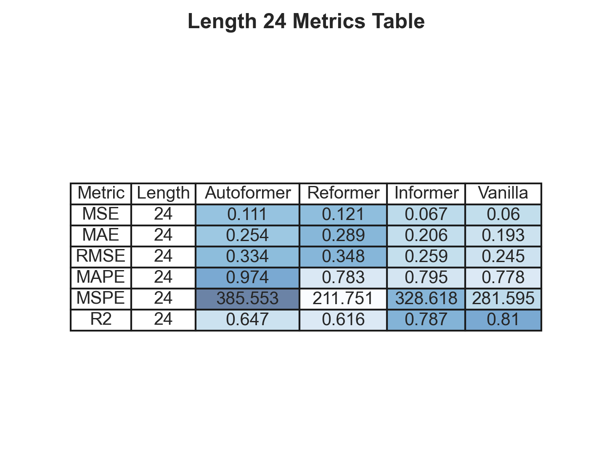
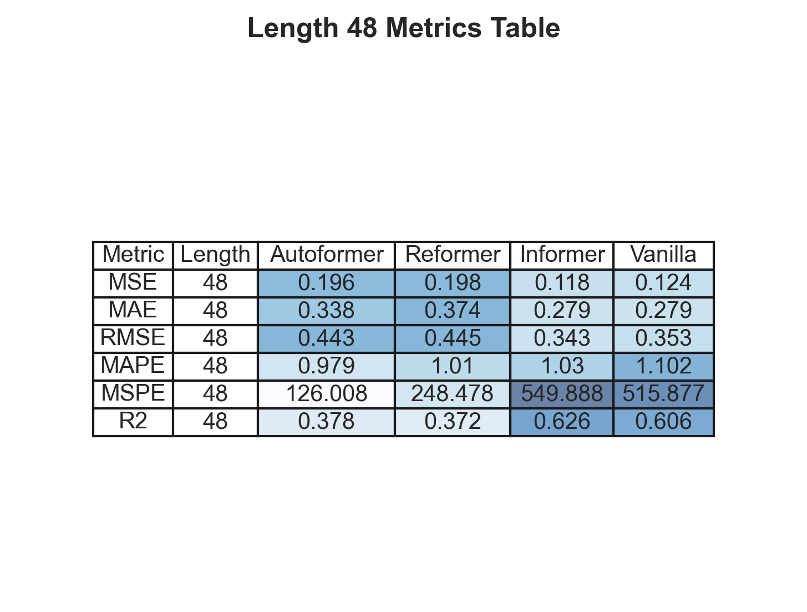
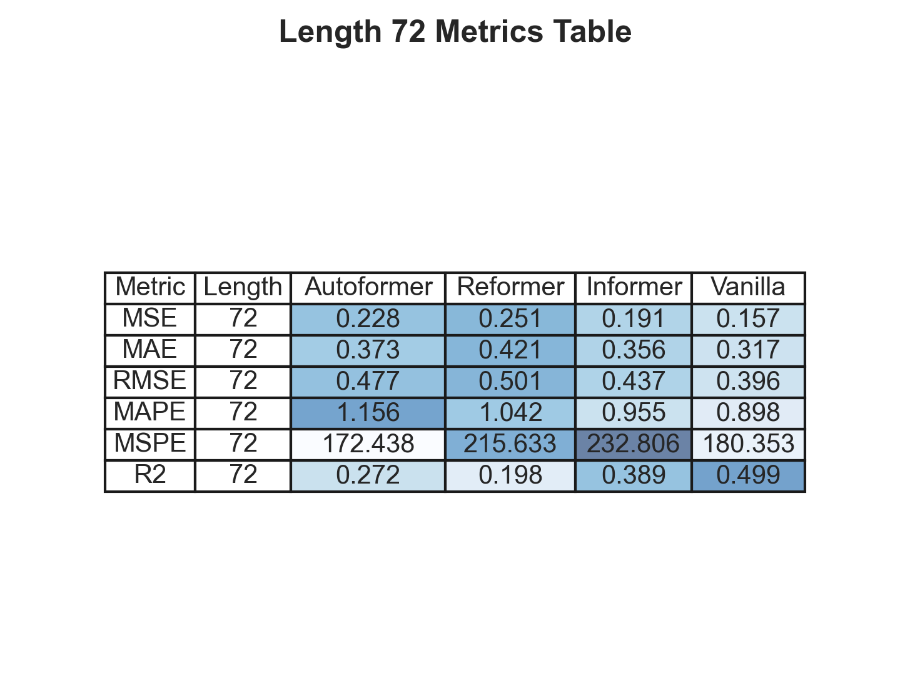
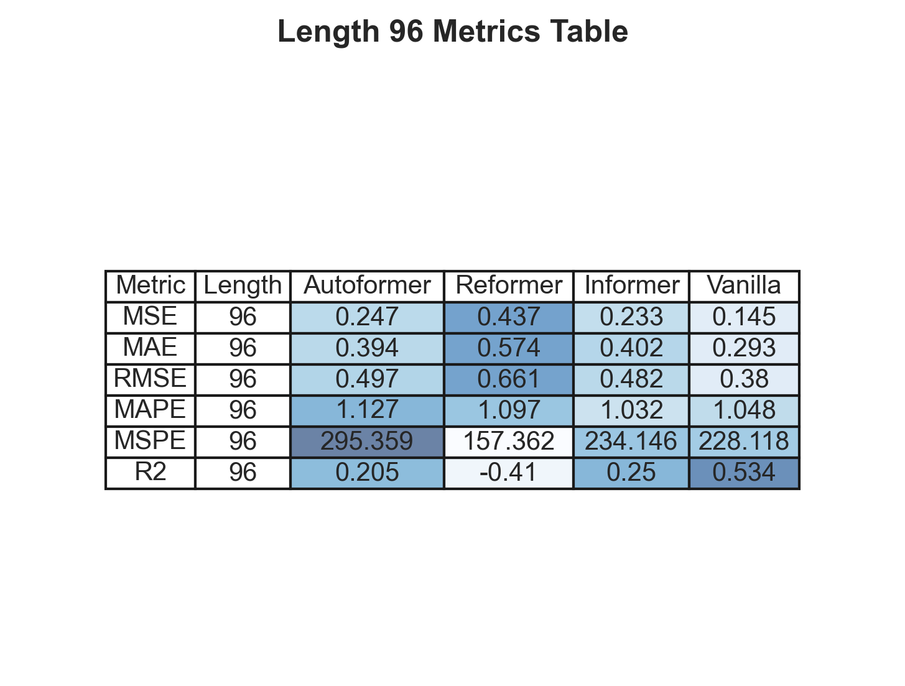

# Ham Petrol Fiyat Tahmini: Transformer Modell Eğitimi

Bu proje, transformatör tabanlı modeller kullanılarak saatlik ham petrol fiyat tahmini yapmak üzerine odaklanmıştır. Modellerin performansı, iki yıllık saatlik ham petrol fiyat verisi kullanılarak değerlendirilmiştir. Aşağıdaki modeller çalışmanın temelini oluşturmuştur:

- **Autoformer**
- **Informer**
- **Reformer**
- **Vanilla Transformer**
- **ETT** (Efficient Transformer for Time-series)

## Transformer Modelleri Hakkında

### Autoformer
Autoformer, zaman serisi tahmini için tasarlanmış bir modeldir. Ana yeniliklerinden biri, verimli uzun vadeli dikkat mekanizması ve mevsimsel bileşenleri otomatik olarak öğrenme yeteneğidir. Bu sayede, geleneksel modellere kıyasla daha doğru tahminler yapabilir.

### Informer
Informer, dikkat mekanizmasını optimize ederek uzun zaman serilerini etkili bir şekilde işleme yeteneğine sahiptir. Kullanımındaki Sparse Self-attention mekanizması, modelin bellek ve zaman verimliliğini artırır.

### Reformer
Reformer, dikkat hesaplamalarını daha hafif ve hızlı hale getirmek için tasarlanmıştır. Lokally Sensitive Hashing (LSH) algoritmasını kullanarak dikkat hesaplamalarını optimize eder ve uzun dizileri daha etkili bir şekilde öğrenir.

### Vanilla Transformer
Vanilla Transformer, transformatör mimarisinin temel bir uygulamasıdır. Zaman serisi problemlerinde genellikle temel karşılaştırma modeli olarak kullanılır. Performansı, uzun vadeli bağlantıları yakalama yeteneğine bağlıdır.

### ETT (Efficient Transformer for Time-series)
ETT, zaman serisi tahmini için optimize edilmiş bir transformer modelidir. Verimliliği artırmak için özelleştirilmiş mekanizmalar kullanır ve çeşitli zaman serisi problemlerine uyum sağlar.

## Veri Seti

Bu projede kullanılan veri seti, iki yıllık saatlik ham petrol fiyat bilgilerinden oluşmaktadır. Veriler, modeli beslemek ve gelecekteki fiyat hareketlerini tahmin etmek için önceden işlenmiştir.

-[https://github.com/YusufPerktas/Time-Series-Machine-Learning](https://github.com/YusufPerktas/Time-Series-Machine-Learning)

## Kullanılan Araçlar ve Kütüphaneler

Projede aşağıdaki araçlar ve kütüphaneler kullanılmıştır:

- **Python** ve çeşitli veri bilimi kütüpaneleri (Örneğin, NumPy, Pandas, Matplotlib)
- **PyTorch**: Modellerin eğitimi ve değerlendirilmesi için kullanıldı.
- **Keras/TensorFlow**: Alternatif olarak bazı modellerin ızlenmesi için kullanıldı.
- **Sklearn**: Değerlendirme metrikleri için.

## Proje Yapısı

1. **Veri Hazırlık**
   - Veri temizleme ve öznitelik mühendisliği.
   - Zaman serisi formatında veri girişi.
2. **Modelleme**
   - Belirtilen transformatör modelleri ile çalışma.
   - Hiperparametre optimizasyonu.
3. **Performans Değerlendirme**
   - Modellerin **MSE**, **MAE**, **RMSE**, **MAPE**, **MSPE** ve **R^2** gibi metriklerle değerlendirilmesi.
   - Sonuçların görsel sunumu.

## Sonuçlar

Modellerin performans karşılaştırması aşağıdaki verilerde verilmiştir:

## Yararlanılan Kaynaklar

Projede aşağıdaki kaynaklardan yararlanılmıştır:

- [https://github.com/thuml/Autoformer](https://github.com/thuml/Autoformer)
- [https://github.com/zhouhaoyi/Informer2020](https://github.com/zhouhaoyi/Informer2020)
- [https://huggingface.co/docs/transformers](https://huggingface.co/docs/transformers/model_doc/time_series_transformer)
